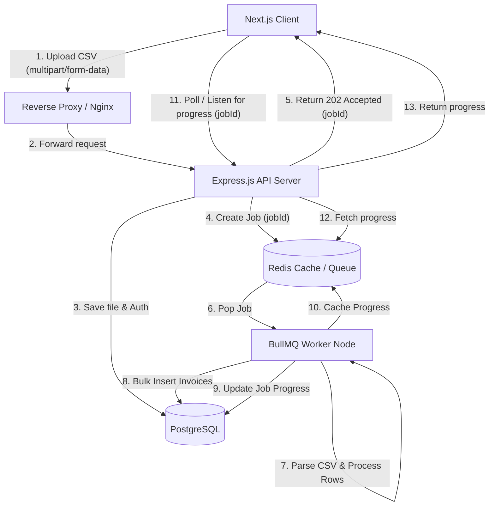

# High-Level Design (HLD) - ClearTax Bulk Invoice Processor

## 1. System Overview
ClearTax is a bulk invoice uploading and reconciliation platform. It consists of a React/Next.js frontend that allows users to upload large CSV files containing invoices, and a Node.js/Express backend that safely and asynchronously processes these files. The backend utilizes Redis and BullMQ to queue the processing of large files so that the API remains responsive.

## 2. System Architecture

The architecture follows a classic Client-Server model with an asynchronous worker pattern for heavy processing tasks.

## 3. Technology Stack

### Frontend (Client)
- **Framework:** Next.js 14/15 (App Router)
- **UI Library:** React 19
- **State Management:** Zustand (Client State), React Query (Server State)
- **Styling:** Tailwind CSS + Radix UI Primitives

### Backend (Server)
- **Framework:** Express.js (Node.js)
- **Database:** PostgreSQL
- **ORM:** Prisma
- **Message Queue / Background Jobs:** BullMQ + Redis
- **File Upload:** Multer

## 4. Core Workflows

### 4.1 Authentication & Authorization
1. The user inputs their credentials in the Client application (`/login`).
2. The API Server validates the credentials against PostgreSQL.
3. Upon success, the API signs a JSON Web Token (JWT) and returns it to the Client.
4. The Client (Zustand store) persists this JWT and attaches it as an `Authorization: Bearer <token>` header for all subsequent protected API requests.

### 4.2 Asynchronous Bulk Upload
1. The user drags a CSV file into the `/upload` route on the Client.
2. The file is sent via a `multipart/form-data` POST request.
3. `Multer` middleware on the API Server intercepts the file, saving it temporarily to disk or memory.
4. The API creates an `UploadBatch` record in PostgreSQL (Status: `PENDING`).
5. The API pushes a new job to the BullMQ Redis queue containing the path to the uploaded file and the `batchId`.
6. The API immediately responds to the Client with the `batchId` (202 Accepted) without waiting for processing to finish.

### 4.3 Background Processing
1. A BullMQ worker, running either on the same server instance or a separate dedicated node, pulls the job from Redis.
2. The worker streams the CSV file using `papaparse`, processing it in chunks to avoid blowing up memory constraints.
3. For each valid row, it determines if the invoice is a `MATCHED` or `MISMATCHED` (mock validation logic).
4. Bad rows result in a `FAILED` status with an `errorMessage`.
5. The worker performs bulk upserts/inserts to the `Invoice` table in PostgreSQL.
6. The worker periodically updates the `UploadBatch` progress (`processedRows`, `successfulRows`, `failedRows`) in both PostgreSQL and Redis.
7. Upon completing the file, the `UploadBatch` status is updated to `COMPLETED` or `FAILED`.

### 4.4 Real-time Progress Tracking
1. Using the `batchId` returned during upload, the Client application periodically polls the `/api/jobs/:id/status` endpoint (via React Query background refetching).
2. The API server quickly retrieves the latest progress from Redis (or DB fallback) and returns it.
3. The Client UI updates progress bars and statistics based on this response.
