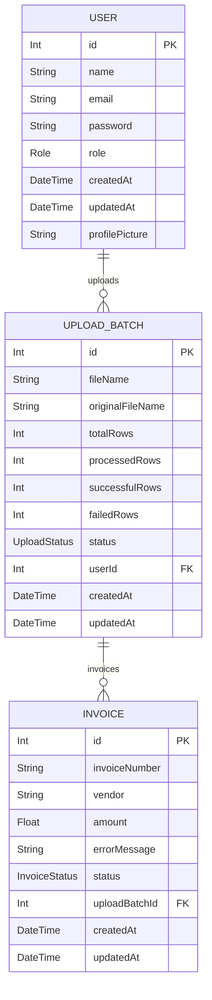
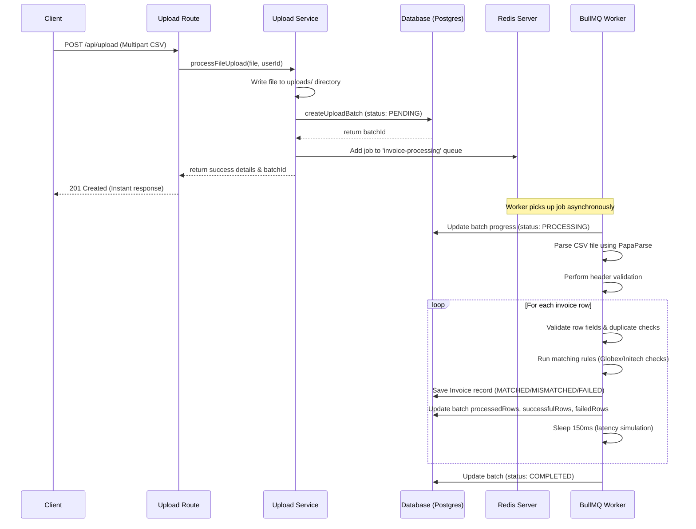

# Backend Architecture & Flow

This document describes the current backend implementation: Express routes, Prisma models, Redis and BullMQ job processing, and the upload lifecycle.

---

## 1. Technology Stack

* **Runtime Environment**: Node.js
* **Application Framework**: Express.js
* **Database Client & ORM**: Prisma Client configured for PostgreSQL
* **In-Memory Queue Store**: Redis
* **Job Queue Engine**: BullMQ
* **Validation Library**: Zod
* **File Upload Processing**: Multer

---

## 2. Directory Structure

The backend follows a layered structure under `server/src/`, where each directory has a distinct responsibility:

```text
server/
├── prisma/
│   ├── schema.prisma          # Database schema definitions
│   └── seed.js                # Database seeder script
├── src/
│   ├── config/                # Environment variables, Prisma client, and Redis client
│   ├── middleware/            # Express request middleware such as authentication
│   ├── queues/                # BullMQ queue definitions
│   ├── repositories/          # Prisma database query helpers
│   ├── routes/                # REST API routers
│   ├── services/              # Business logic for auth, upload processing, and reports
│   ├── validations/           # Zod schema definitions
│   ├── workers/               # Background BullMQ workers
│   └── server.js              # Application entry point and graceful shutdown handlers
└── uploads/                   # Local folder storing uploaded CSV files
```

### Folder Responsibilities

* **`config/`**: Sets up the application configuration and shared clients.
* **`routes/`**: Registers the endpoint paths for auth, uploads, invoices, and reports.
* **`middleware/`**: Houses the JWT auth guard used to secure routes.
* **`services/`**: Implements core business logic such as auth, upload orchestration, retry triggering, and report aggregation.
* **`repositories/`**: Abstract layer isolating Prisma interactions from business services.
* **`queues/`**: Initializes the BullMQ `Queue` instance.
* **`workers/`**: Initializes the BullMQ `Worker` instance to run background jobs.
* **`validations/`**: Configures data validators such as signup and login body validation.

---

## 3. Database Design

The database uses PostgreSQL as its primary data store, with Prisma as the ORM. The relational structure consists of three main models:



### Enums
* **`Role`**: `USER`, `ADMIN`
* **`UploadStatus`**: `PENDING`, `PROCESSING`, `COMPLETED`, `FAILED`
* **`InvoiceStatus`**: `PENDING`, `MATCHED`, `MISMATCHED`, `FAILED`

---

## 4. Asynchronous Queue Processing Flow

To keep the application highly responsive, files are processed asynchronously in the background. The detailed data flow works as follows:



### BullMQ Worker Processing Steps (`invoice.worker.js`)

1. **Verify & Read File**: Validates that the uploaded CSV file exists on disk and is not empty.
2. **Header Parsing**: Uses `PapaParse` to parse the CSV file content. Inspects headers and checks for mandatory fields:
   * **Invoice Number** (Accepts: `invoicenumber`, `invoice number`, `id`, `invoice_number`)
   * **Vendor** (Accepts: `vendor`, `customer`, `supplier`, `vendorname`, `vendor name`)
   * **Amount** (Accepts: `amount`, `price`, `total`)
   * If any of these headers are missing, the worker throws a file-level error and transitions the batch status to `FAILED`.
3. **Initialize Database State**: Transitions the `UploadBatch` status from `PENDING` to `PROCESSING` and stores `totalRows`.
4. **Row-by-Row Execution**: Loops through each parsed CSV row:
   * **Data Extraction**: Resolves custom names and structures to standard variables (`invoiceNumber`, `vendor`, `amount`).
   * **Validations**:
     * Missing invoice number -> Mark row as `FAILED` (Error: *"Missing Invoice Number"*).
     * Missing vendor name or vendor name is "default vendor" -> Mark row as `FAILED` (Error: *"Missing Vendor Name"*).
     * Amount <= 0 or invalid -> Mark row as `FAILED` (Error: *"Invalid Amount"*).
     * Duplicate inside same batch -> Mark row as `FAILED` (Error: *"Duplicate Invoice Number"*).
     * Duplicate database-wide for the same user -> Mark row as `FAILED` (Error: *"Duplicate Invoice Number (Already exists in database)"*).
   * **Matching Rules**: If validations pass, the worker tests rules:
     * If vendor name contains **"globex"** -> Status is `MISMATCHED` (Error: *"Amount difference detected"*).
     * If vendor name contains **"initech"** -> Status is `FAILED` (Error: *"Invalid invoice format"*).
     * Otherwise -> Status is `MATCHED` (No error).
   * **Persist Record**: Saves a new `Invoice` row referencing the batch ID.
   * **Increment Counters**: Updates `processedRows`, `successfulRows`, and `failedRows` columns in the `UploadBatch` table.
   * **Simulate Latency**: Executes a 150ms delay per row to allow the user to watch progress metrics scale in the UI dashboard.
5. **Final Transition**: Updates the batch status to `COMPLETED` when the loop is done, or to `FAILED` if a fatal parsing exception occurs.

---

## 5. API Endpoints

### 5.1 Authentication Routes (`/api/auth`)

* `POST /signup`: Registers a new user account.
* `POST /login`: Validates credentials, returns a JWT token, and passes user metadata.
* `GET /me`: Secured route. Returns the current authenticated user's profile details.
* `PUT /me`: Secured route. Updates the user's profile name, password, or profile picture avatar (saves uploads locally to `public/avatars`).
* `POST /forgot-password`: Generates an OTP reset code and logs/sends it.
* `POST /verify-otp`: Validates the provided OTP.
* `POST /reset-password`: Verifies the OTP and updates the user's password.

### 5.2 Upload & Invoices Routes (`/api`)

* `POST /upload`: Secured route. Expects a CSV file multipart form. Saves the file, creates a batch, adds a job to BullMQ, and immediately returns the batch details.
* `GET /upload`: Secured route. Retrieves all upload batches uploaded by the user.
* `GET /upload/:id` / `GET /uploads/:id`: Secured route. Fetches full metadata of a batch including all parsed invoice rows.
* `GET /uploads`: Secured route. Fetches upload batches with page offset (`page`), rows per page (`limit`), searches, and filters.
* `GET /invoices`: Secured route. Fetches detailed invoice rows across batches with pagination, sorting (e.g., `amount`, `status`, `invoiceNumber`), search terms, and status filters.
* `GET /uploads/:id/progress`: Secured route. Returns the raw progress numbers (`totalRows`, `processedRows`, `successfulRows`, `failedRows`) and calculates the `percentage` for the UI.
* `POST /uploads/:id/retry`: Secured route. Deletes previous invoice records, resets the batch counters, and re-queues the file for background processing.

---

## 6. Graceful Shutdown Flow

To prevent socket, database connection, or job worker leaks when terminating the application, the server binds hooks for `SIGINT` (Ctrl+C) and `SIGTERM`.

When triggered, the bootstrap script executes the `shutdown()` function:
1. **Stop Express Listener**: Closes the web server listener so it refuses new incoming HTTP requests.
2. **Shutdown Worker**: Closes the BullMQ `Worker` instance to ensure active jobs finish and no new jobs are fetched from Redis.
3. **Close Redis client**: Disconnects all active connections to the Redis database.
4. **Disconnect database client**: Closes the Prisma database connections.
5. **Exit Process**: Ends the Node process with the appropriate code.
